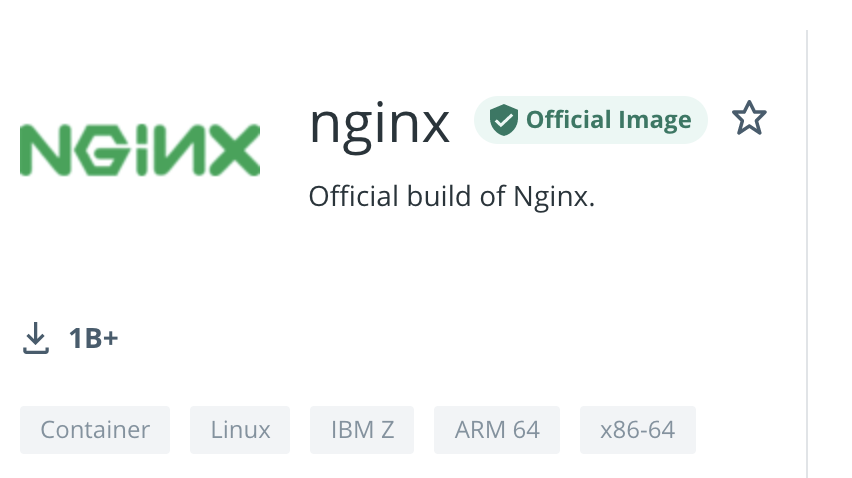
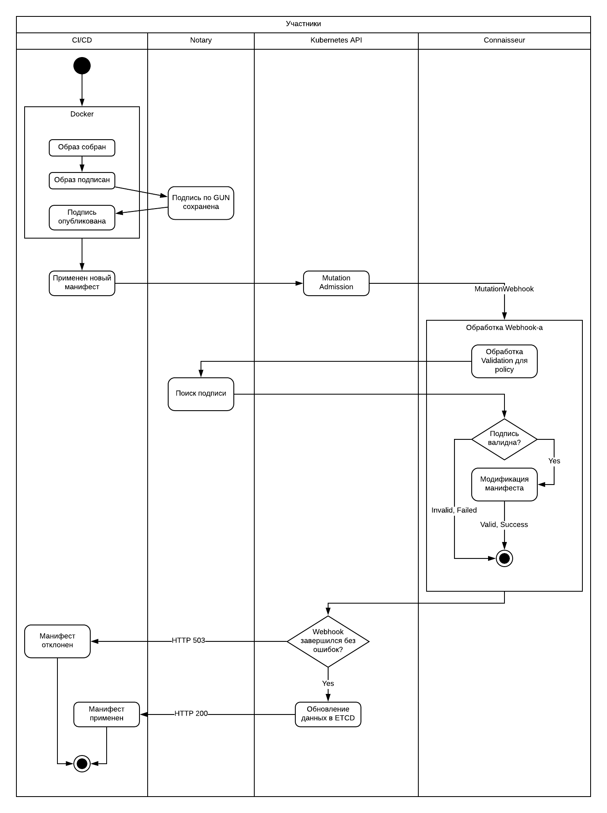
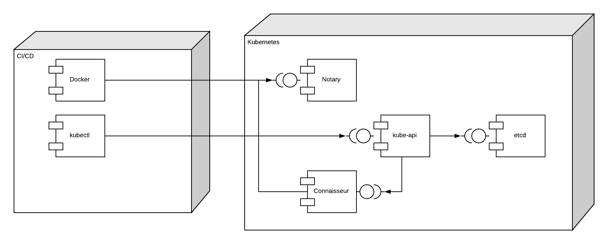

# DCT: Интеграция Notary V1 и Connaisseur в Kubernetes

## Полезные ссылки

- [Описание Docker Content Trust](https://docs.docker.com/engine/security/trust/)
- [О типах ключей в DCT и Notary, а также как ими управлять](https://docs.docker.com/engine/security/trust/trust_key_mng/)
- [Описание CLI Notary](https://github.com/notaryproject/notary/blob/master/docs/command_reference.md)

##  Введение

Угрозы безопасности не стоят на месте. С развитием и популяризацией концепции микросервисов, большую распространенность получили проблемы безопасности, сокрытые в базовых образах, используемые для поставки разрабатываемого кода (отчет от [Snyk](https://snyk.io/blog/top-ten-docker-images-contain-over-8000-vulnerable-paths/), более формальное [академическое исследование](https://academic.oup.com/gigascience/article/10/6/giab025/6291571)).

Один из векторов атаки - использование образов из недоверенных источников, поэтому одна из основных рекомендаций по обеспечению ([1](https://snyk.io/blog/10-docker-image-security-best-practices/), [2](https://blog.aquasec.com/docker-security-best-practices)) - использование базовых образов из доверенных источников.



Но даже в этом случае злоумышленник может скомпрометировать репозиторий и подменить образ на его вредоносную копию.

Предположим, для наиболее популярных образов контейнеров (Alpine, Nginx, Node и т.д.) можно довериться уровню компетенции технических специалистов. Но что же делать тем системам, которые находятся в закрытом контуре, но стоит необходимость в:

1. Проверке источника образа (а именно, репозитория, откуда берется запускаемый образ)
2. Подтверждении авторства и целостности образа

В целом, Admission Controller-ы (к примеру, [GateKeeper](https://github.com/open-policy-agent/gatekeeper)) могу справиться с первой задачей, так как путь регистра явно прописан в манифесте деплоя. Но для проверки целостности и авторства необходима система проверки подписи, а также инфраструктура для обмена этими подписанными.

Для решения вопроса проверки целостности и авторства цифрового контента, активно применяется системы криптографической подписи. В этом плане, контейнерные системы не являются исключением.

Существует два распространенных варианта для создания и проверки подписи образов:

1. Формирование и проверка подписи с помощью [cosign](https://github.com/sigstore/cosign) и [skopeo](https://www.redhat.com/en/blog/skopeo-10-released#:~:text=Skopeo%20is%20a%20tool%20for,storage%20on%20your%20local%20system.)
2. Использование Docker Content Trust-а с интеграцией с [Notary](https://github.com/notaryproject/notary)

Проект [cosign](https://github.com/sigstore/cosign) имеет свои преимущества, так как подпись образов хранится в файле, который может поставляться отдельно (как публичный ключ GPG для Debian-репозиториев), либо же распространение через проекты [sigstore](https://github.com/sigstore).

К примеру, пользователи OpenShift могут воспользоваться встроенными возможностями по проверки подписи ([1](https://access.redhat.com/verify-images-ocp4), [2](https://docs.openshift.com/container-platform/3.9/admin_guide/image_signatures.html), [3](https://luis-javier-arizmendi-alonso.medium.com/container-image-signatures-in-openshift-4-a62b9e1c1b5a), [4](https://github.com/redhat-cop/image-scanning-signing-service))

Однако в данной статье мы будем рассматривать интеграцию Docker Content Trust с помощью Notary, по нескольким причинам:

- Более привычная интеграция для большинства пользователей, так как подавляющее большинство современных ИТ-специалистов так или иначе слышали или работали с Docker
- Повторное использование уже готовых компонентов, без необходимости разработки дополнительных скриптов и инструментов

Но при этом нужно понимать и подводные команды подобного решения, об этом - в конце.

## Обзор компонентов

Далее представлен обзор двух главных игроков, которые представлены здесь:

- Docker Content Trust
- Notary
- Connaisseur

### Docker Content Trust

Docker Content Trust (DCT) - часть инструментов, поставляемых в составе Docker-а. Они позволяют подписывать части собираемых образов и публиковать их на специальный сервис Notary, где и хранятся подписи. Инженеры могут [поднять собственный сервис Notary](https://docs.docker.com/engine/security/trust/deploying_notary/), так и воспользоваться сервисом по умолчанию, поставляемый как часть Dockerhub-а.

### Notary

Сервер Notary - веб-сервис, который можно использовать для хранения подписей для медиа-файлов. Проект развивался для реализации DCT, сейчас он вышел в собственное плавание и даже вошел в консорциум [CNCF](https://www.cncf.io/blog/2021/07/28/enforcing-image-trust-on-docker-containers-using-notary/).

Технически, на Notary можно хранить любые файлы и подписи к ним. Конкретно DCT использует API Notary для хранения информации о подписи слоев.

Notary базируется на [The Update Framework](https://theupdateframework.io/), фреймворк, который описывает, как работать с подписями доверенных файлов, им проверки, обновлении и т.д.

Notary работает с так называемым Trusted Collection, набор которых имеет единый GUN (Global Unique Name). Говоря проще, это аналог URI. Для Docker Content Trust-а, индивидуальный путь к образу определяется как:

```shell
[REGISTRY_HOST[:REGISTRY_PORT]/]REPOSITORY[:TAG]
```

Таким образом, в качестве GUN-а будет выступать строка `[REGISTRY_HOST[:REGISTRY_PORT]/]REPOSITORY`, а множество тегов для этого образа - Trusted Collection.


Архитектура Notary состоит нескольких компонентов и наборов ключей, подробнее расписано в этой [статье](https://github.com/notaryproject/notary/blob/master/docs/service_architecture.md).

> К примеру, проект Notary используется для реализации функционала формирования и проверки подписи для популярного репозитория артефактов [Harbor](https://goharbor.io/)

По поводу компонентов важно значь, что есть четыре важных компонента:

- Notary Server - backend-сервис, который принимает API запросы
- TUF DB - локальная база для Notary Server, где он хранит информацию о подписанных метаданных. Может представлять собой набор локальных файлов в директории `./notary/trust/tuf`
- Notary Signer - сервис, взаимодействует с Notary Server, выполняет подпись документов
- DB - база данных, в которой хранит информацию Notary Signer. К примеру, может выступать MySQL.

Все немного сложнее с набором ключей, всего их 4 разновидностей:

- Root Key - корневой ключ, единый на весь сервер Notary. Сам ключ и пароль от него должны хранится офлайн. Потеря Root Key-я или его компрометация означает необходимость перевыпуска всех ключей.
- Timestamp Key - гарантирует обновление данных. Хранится на сервере, беспокоиться о нем не нужно.
- Snapshot Key - гарантирует подпись метаданных на стороне сервер. Также управляется автоматически
- Target Key - непосредственно ключ, которым подписывается данные. Для одного репозитория может быть несколько Target Key со своими делегированиями ролей (к примеру, 2 администратора и один CI/CD аккаунт, к помощью которых подписываются конкретные файлы)

За подробностями терминологии стоит обратиться к этому [[документу](https://github.com/notaryproject/notary/blob/master/docs/command_reference.md#terminology-reference)].

Есть два поколения протокола для Notary:

- v1 - наиболее распространённый и адаптированный вариант
- v2 - инициатива CNCF по использованию Notary как стандарт де-факто для проверки подписей для всех Cloud-Native проектов, в частности, для репозиториев образов контейнеров. (см [1](https://www.youtube.com/watch?v=SZMbuirEQVU), [2](https://www.docker.com/blog/community-collaboration-on-notary-v2/)). Развивается как проект [notation](https://github.com/notaryproject/notation), его адаптация вне публичных облаков - затруднительна.

Несмотря на то, что некоторые уже считают Notary V1 deprecated (к примеру, [IBM Cloud](https://cloud.ibm.com/docs/Registry?topic=Registry-registry_trustedcontent)), мы будем использовать именно эту версию как наиболее адаптированную в текущих условиях.

### Connaisseur

[Connaisseur](https://github.com/sse-secure-systems/connaisseur) - Admission Controller для Kubernetes, который проверяет подписи запускаемых образов, и в зависимости от настроенных политик безопасности, разрешает или запрещает их запуск.

В качестве альтернативы, у него есть аналогичный собрат от IBM - [Portieris](https://github.com/IBM/portieris). Также есть успешный опыт [интеграции Notary + OPA в Kubernetes)[https://siegert-maximilian.medium.com/ensure-content-trust-on-kubernetes-using-notary-and-open-policy-agent-485ab3a9423c].

## Схема интеграции



- Через CI/CD систему проходит процесс сборки нашего образа. В ходе сборки выполняется подпись `target/releases` ключами, сама подпись публикуется в Notary сервер, размещенный внутри кластера Kubernetes. Следующим шагом CI Pipeline-а идет процесс деплоя манифестов или обновление существующего инстанса с использованием подписанного образа.
- Внутри кластера Kubernetes также размещается Connaisseur Admission Controller. Он настроен на проверку подписи запущенной нагрузки в определенном Namespace-е. Он интегрирован в сервер Notary, замещенном в соседнем Namespace-е
- Когда происходит создание/обновление манифеста Pod-а, срабатывает Webhook на Connaisseur. Он обращается к серверу Notary за подписью по указанному GUN-у.
- В случае, если подпись для GUN-а отсутствует или не совпадает с подписью образа, создание Pod-а завершается с ошибкой. Если совпадает, но используемый тег образа замещается на его SHA256-хеш. В итоге, если происходит деплой образа `docker.io/nginx:latest`, то после всех мутаций, будет запущен образ `docker.io/nginx@SHA256:d1jimcc....`.


Далее представлено размещение компонентов в этой схеме



Lifecycle обработки API запросов Kubernetes, а также узнать, где в этой связке находятся применение Webhook-ов, можно [здесь](https://kubernetes.io/blog/2019/03/21/a-guide-to-kubernetes-admission-controllers/).

## План интеграции

- Установка Notary в Kubernetes
- Интеграция Docker + Notary
- Установка Connaisseur в Kuberentes
- Интеграция Notary + Connaisseur
- Проверка инсталляции

### Установка Notary в Kubernetes

К сожалению, на данный момент нет готового Helm Chart-а для Notary от мейнтейнеров проекта (Issue [#1502](https://github.com/notaryproject/notary/issues/1502)), однако мы можем воспользоваться наработками от проекта, в котором интегрируют Notary+OPA:

```
git clone https://github.com/k8s-gadgets/k8s-content-trust.git

cd k8s-content-trust/notary-k8s/helm

chmod +x ./notary/generateCerts.sh && ./notary/generateCerts.sh

helm install notary -n notary --create-namespace
```

Сохраняем сертификат Notary-сервера, необходим для локальной интеграции, а также для Connaisseur -а:

```shell
kubectl get secret -n notary  notary-server-certs -o jsonpath='{.data.root-ca\.crt}' | base64 -d
```

### Интеграция Docker + Notary

Скачиваем и устанавливаем CLI утилиту [notary](https://github.com/notaryproject/notary/releases/tag/v0.6.1).

К примеру, для MacOS:

```shell
wget https://github.com/notaryproject/notary/releases/download/v0.6.1/notary-Darwin-amd64
sudo install notary-Darwin-amd64 /usr/local/bin/notary

notary version
```

Доступ к инсталляции Notary внутри Kubernetes можно получить через Service: `notary-server-svc`.

Проксируем порт до Pod-а (можно настроить через Ingress, если необходимо):

```shell
> kubectl get pods -n notary

NAME                                    READY   STATUS    RESTARTS   AGE
notary-db-sts-0                         1/1     Running   0          22m
notary-server-deploy-54dbc6c45d-2wdmg   1/1     Running   0          22m
notary-signer-deploy-56cdbf98c5-njtph   1/1     Running   0          22m

> kubectl port-forward -n notary notary-server-deploy-54dbc6c45d-2wdmg 4443:4443

Forwarding from 127.0.0.1:4443 -> 4443
Forwarding from [::1]:4443 -> 4443
```

Также выставляем статическую запись для проверки TLS:

```shell
echo "127.0.0.1 notary-server-svc" >> /etc/hosts
```

В качестве системы контейнеризации будем использовать Docker.
Копируем сертификат и конфигурацию для Notary, который будет поддерживать интеграцию с Docker Content Trust:

```shell
mkdir -p ~/.notary
kubectl get secret -n notary  notary-server-certs -o jsonpath='{.data.root-ca\.crt}' | base64 -d > ~/.notary/root-ca.crt

cat <<EOF> ~/.notary/config.json
{
        "trust_dir" : "~/.docker/trust",
        "remote_server": {
                "url": "https://notary-server-svc:4443",
                "root_ca": "root-ca.crt"
        }
}
EOF
```

Добавляем сертификат `~/.notary/root-ca.crt` для Docker-а в качестве доверенного:

```shell
mkdir -p ~/.docker/tls/notary-server-svc:4443
cp ~/.notary/root-ca.crt ~/.docker/tls/notary-server-svc:4443
```

Проинициализируем соответствующий Trusted Collection, в ходе которого вам будет предложено заполнить пароли для:

- Root Key
- Target Key
- Snapshot Key

```shell
> notary init docker.io/smuraiwarrior2012

You are about to create a new root signing key passphrase. This passphrase
will be used to protect the most sensitive key in your signing system. Please
choose a long, complex passphrase and be careful to keep the password and the
key file itself secure and backed up. It is highly recommended that you use a
password manager to generate the passphrase and keep it safe. There will be no
way to recover this key. You can find the key in your config directory.
Enter passphrase for new root key with ID c771cf0: 
Repeat passphrase for new root key with ID c771cf0: 
Passphrases do not match. Please retry.
Enter passphrase for new root key with ID c771cf0: 
Repeat passphrase for new root key with ID c771cf0: 
Enter passphrase for new targets key with ID 32590f5: 
Repeat passphrase for new targets key with ID 32590f5: 
Enter passphrase for new snapshot key with ID 24c0c84: 
Repeat passphrase for new snapshot key with ID 24c0c84:


> notary key list

ROLE        GUN                          KEY ID                                                              LOCATION
----        ---                          ------                                                              --------
root                                     4ba5be011565d44df39adb221b71c874a7cb8eadadfe324425a165dec53fd906    /Users/kukartsevks/.docker/trust/private
snapshot    ...r.io/smuraiwarrior2012    bf6197361f711434374ab0028b404298a0ec4cb802e9814088c431b9a2174743    /Users/kukartsevks/.docker/trust/private
targets     ...r.io/smuraiwarrior2012    1773ab2aa042ab47c38e40284f7c94fe28a73626bdfc99dd9669a9bae6383652    /Users/kukartsevks/.docker/trust/private
```

Выставляем переменные для включения DCT:

```shell
export DOCKER_CONTENT_TRUST=1
export DOCKER_CONTENT_TRUST_SERVER=https://notary-server-svc:4443
```

Далее создадим отдельного пользователя и делегируем ему роль `targets/releases` для осуществления подписи образов:

```shell
> docker trust key generate kirkirillka

Generating key for kirkirillka...
Enter passphrase for new kirkirillka key with ID bf33ee9:
Repeat passphrase for new kirkirillka key with ID bf33ee9:
Successfully generated and loaded private key.  Corresponding public key available: kirkirillka.pub
```

Работать будем с образами Nginx, располагающиеся в публичном репозитории  `docker.io/smuraiwarrior2012/nginx`, где я буду хранить образы, однако вы можете воспользоваться любым другим, в том числе и приватным в вашей инфраструктуре. Отличие будет в том, что мы будем использовать Notary сервер, размешенный в нашем Kubernetes кластере.

Добавим соответствующего пользователя в цепочку делегирования для указанной Trusted Collection. В ходе работы вам предстоит:

- Указать существующий пароль для Root Key
- Установить пароль для ключа нового репозитория Repository Key
- Установить пароль для ключа `targets/releases` роли

```shell
> docker trust signer add --key kirkirillka.pub kirkirillka docker.io/smuraiwarrior2012/nginx

Adding signer "kirkirillka" to docker.io/smuraiwarrior2012/nginx...
Initializing signed repository for docker.io/smuraiwarrior2012/nginx...
Enter passphrase for root key with ID 4ba5be0: 
Enter passphrase for new repository key with ID 8f8fd3f: 
Repeat passphrase for new repository key with ID 8f8fd3f: 
Successfully initialized "docker.io/smuraiwarrior2012/nginx"
Successfully added signer: kirkirillka to docker.io/smuraiwarrior2012/nginx
```

Далее мы должны убедиться, что на удаленном сервере Notary есть нужные ключи (обратите внимание на совпадающие Key IDS):

```shell

> notary key list

ROLE           GUN                          KEY ID                                                              LOCATION
----           ---                          ------                                                              --------
root                                        4ba5be011565d44df39adb221b71c874a7cb8eadadfe324425a165dec53fd906    /Users/kukartsevks/.docker/trust/private
kirkirillka                                 bf33ee90f5c1641545f0c14b404b74ee0abceb6ea390862e4555ea228bded80a    /Users/kukartsevks/.docker/trust/private
snapshot       ...r.io/smuraiwarrior2012    bf6197361f711434374ab0028b404298a0ec4cb802e9814088c431b9a2174743    /Users/kukartsevks/.docker/trust/private
targets        ...r.io/smuraiwarrior2012    1773ab2aa042ab47c38e40284f7c94fe28a73626bdfc99dd9669a9bae6383652    /Users/kukartsevks/.docker/trust/private
targets        ...muraiwarrior2012/nginx    8f8fd3f59e082e1198af21e8eecbb0b3853d1383e87c36ce44708c07a6fbb833    /Users/kukartsevks/.docker/trust/private

> notary delegation list docker.io/smuraiwarrior2012/nginx

ROLE                   PATHS             KEY IDS                                                             THRESHOLD
----                   -----             -------                                                             ---------
targets/kirkirillka    "" <all paths>    bf33ee90f5c1641545f0c14b404b74ee0abceb6ea390862e4555ea228bded80a    1
targets/releases       "" <all paths>    bf33ee90f5c1641545f0c14b404b74ee0abceb6ea390862e4555ea228bded80a    1

```


Проверим работоспособность системы, загрузив и подписав образ Nginx-а `docker.io/smuraiwarrior2012/nginx`.

Начинаем сборку, подпись и публикацию образа

```
> docker tag docker.io/nginx:latest docker.io/smuraiwarrior2012/nginx:latest
> docker trust sign docker.io/smuraiwarrior2012/nginx:latest

Signing and pushing trust data for local image docker.io/smuraiwarrior2012/nginx:latest, may overwrite remote trust data
The push refers to repository [docker.io/smuraiwarrior2012/nginx]
7e914612e366: Layer already exists
f790aed835ee: Layer already exists
850c2400ea4d: Layer already exists
7ccabd267c9f: Layer already exists
f5600c6330da: Layer already exists
latest: digest: sha256:99d0a53e3718cef59443558607d1e100b325d6a2b678cd2a48b05e5e22ffeb49 size: 1362
Signing and pushing trust metadata
Enter passphrase for kirkirillka key with ID bf33ee9:
Successfully signed docker.io/smuraiwarrior2012/nginx:latest

> docker push docker.io/smuraiwarrior2012/nginx:latest
The push refers to repository [docker.io/smuraiwarrior2012/nginx]
7e914612e366: Layer already exists
f790aed835ee: Layer already exists
850c2400ea4d: Layer already exists
7ccabd267c9f: Layer already exists
f5600c6330da: Layer already exists
latest: digest: sha256:99d0a53e3718cef59443558607d1e100b325d6a2b678cd2a48b05e5e22ffeb49 size: 1362
Signing and pushing trust metadata
Enter passphrase for kirkirillka key with ID bf33ee9:
Successfully signed docker.io/smuraiwarrior2012/nginx:latest
```

Проверим список подписанных тегов в хранилище Notary:

```shell
> notary list docker.io/smuraiwarrior2012/nginx

NAME      DIGEST                                                              SIZE (BYTES)    ROLE
----      ------                                                              ------------    ----
latest    99d0a53e3718cef59443558607d1e100b325d6a2b678cd2a48b05e5e22ffeb49    1362            targets/kirkirillka
```

Как можно убедиться, подпись осуществлена с помощью делегированной роли `targets/kirkirillka` выделенной для конкретного человека, что дает право подписывать с более специфичной роли, нежели `targets/releases`. Если бы мы не добавили роль `targets/kirkirillka`, то в процессе DCT нас бы просили ввести ключ от `targets/releases`.

Информация о подписи с точки зрения Docker-а:

```shell
> docker trust inspect --pretty docker.io/smuraiwarrior2012/nginx

Signatures for docker.io/smuraiwarrior2012/nginx

SIGNED TAG   DIGEST                                                             SIGNERS
latest       99d0a53e3718cef59443558607d1e100b325d6a2b678cd2a48b05e5e22ffeb49   kirkirillka

List of signers and their keys for docker.io/smuraiwarrior2012/nginx

SIGNER        KEYS
kirkirillka   bf33ee90f5c1

Administrative keys for docker.io/smuraiwarrior2012/nginx

  Repository Key:       8f8fd3f59e082e1198af21e8eecbb0b3853d1383e87c36ce44708c07a6fbb833
  Root Key:     489835f6804a35b5964b1a42ce199781ace317ed4e77ff32115e6df7e6fd6651
```

Попробуем запустить образ `docker.io/smuraiwarrior2012/nginx:latest`, а также такой же образ, но под другим названием `docker.io/smuraiwarrior2012/nginx:unsigned`

```shell
> docker run --rm docker.io/smuraiwarrior2012/nginx:latest

/docker-entrypoint.sh: /docker-entrypoint.d/ is not empty, will attempt to perform configuration
/docker-entrypoint.sh: Looking for shell scripts in /docker-entrypoint.d/
/docker-entrypoint.sh: Launching /docker-entrypoint.d/10-listen-on-ipv6-by-default.sh
10-listen-on-ipv6-by-default.sh: Getting the checksum of /etc/nginx/conf.d/default.conf
10-listen-on-ipv6-by-default.sh: Enabled listen on IPv6 in /etc/nginx/conf.d/default.conf
/docker-entrypoint.sh: Launching /docker-entrypoint.d/20-envsubst-on-templates.sh
/docker-entrypoint.sh: Configuration complete; ready for start up

> docker tag docker.io/smuraiwarrior2012/nginx:latest docker.io/smuraiwarrior2012/nginx:unsigned && docker run --rm docker.io/smuraiwarrior2012/nginx:unsigned

docker: No valid trust data for unsigned.
See 'docker run --help'.
```


### Установка Connaisseur в Kubernetes

Возвращаемся в корневую директорию.

Скачиваем и устанавливаем Connaisseur с помощью Helm-Chart-а, используем кастомные правила:

```shell
git clone https://github.com/sse-secure-systems/connaisseur.git --branch v2.1.2
helm install connaisseur connaisseur/helm --atomic --create-namespace --namespace connaisseur -f manifests/content-trust/connaisseur/values.yaml
```

### Интеграция Notary + Connaisseur

Первым делом нам нужно получить информацию о публичном ключе Trusted Root-а для Notary.
Это можно сделать по [официальной инструкции для интеграции с Notary v1](https://sse-secure-systems.github.io/connaisseur/v2.0.0/validators/notaryv1/#getting-the-public-root-key). Вкратце - есть специальный скрипт в составе Connaisseur (`cd connaisseur`), который взаимодействует с Notary, используя его API, чтобы получить публичный ключ:


``` shell
> python3 scripts/get_root_key.py -i  docker.io/smuraiwarrior2012/nginx -s notary-server-svc:4443

KeyID: 489835f6804a35b5964b1a42ce199781ace317ed4e77ff32115e6df7e6fd6651
Key: -----BEGIN PUBLIC KEY-----
MFkwEwYHKoZIzj0CAQYIKoZIzj0DAQcDQgAEI3RccPfmz0krgrVexsQQIVe8F8rK
hAcq8NqAm7nk8cvzL657TqiXnWSwj6IDO/r2eTCOyTTXidEBQxW72gWD0Q==
-----END PUBLIC KEY-----
```

Далее полученный публичный ключ Notary-и и используемый сертификат (`~/.notary/root-ca.crt`) подставляем в соответствующие поля файла, определяющие параметры Helm-инсталляции:

```shell
cat manifests/content-trust/connaisseur/values.yaml
```
Далее представлена конфигурация Trusted Root-а для Connaisseur-а, чтобы он использовал подключение к Notary, расположенному внутри Kubernetes в отдельном Namespace-е:

```yaml
  # static validator that denies each image
  - name: deny
    type: static
    approve: false
  - name: kub-notary
    type: notaryv1 # or other supported validator (e.g. "cosign")
    host: notary-server-svc.notary:4443 # in case of notaryv1, configure the notary server to be used
    trust_roots:
      - name: default
        key: |
          -----BEGIN PUBLIC KEY-----
          MFkwEwYHKoZIzj0CAQYIKoZIzj0DAQcDQgAEI3RccPfmz0krgrVexsQQIVe8F8rK
          hAcq8NqAm7nk8cvzL657TqiXnWSwj6IDO/r2eTCOyTTXidEBQxW72gWD0Q==
          -----END PUBLIC KEY-----
    cert: |
      -----BEGIN CERTIFICATE-----
      MIIE+zCCAuOgAwIBAgIUOdJ2WGxK/4KiwXfpH8zPR8ZxBZcwDQYJKoZIhvcNAQEL
      BQAwFDESMBAGA1UEAwwJbm90YXJ5LWNhMB4XDTIxMDkyMTE5NDAwNVoXDTMxMDkx
      OTE5NDAwNVowFDESMBAGA1UEAwwJbm90YXJ5LWNhMIICIjANBgkqhkiG9w0BAQEF
      AAOCAg8AMIICCgKCAgEAqySGeV9+MIjsypw/g10fspZE+C9UOQHUvX72uTxxbIx4
      vrODEv4N/ovkdRCxJ45rph3wIDsij/Zu9aKYYRUW4kpiA57xoY5Zhtwca2LcIJ60
      KxmIByluBkn33GFy9SXddk3i1yt13SHSo+W5vTXMFqiaGHu6Y+Dnb46Yh/rSjuqI
      ChFAo9wQ4vSuMX
```

Также обратите внимание на секцию валидаторов, которая гласит, что для валидации подписи образов:

```yaml
    # Политика проверки для целевого репозитория
  - pattern: "docker.io/smuraiwarrior2012/*:*"
    validator: kub-notary
```

Помимо этого, обратите внимание, что мы проводим валидацию только тех namespace-ов, которые явно помечены label-ом `securesystemsengineering.connaisseur/webhook: validate`:

```yaml
# namespaced validation allows to restrict the namespaces that will be subject to Connaisseur verification.
# when enabled, based on namespaced validation mode ('ignore' or 'validate')
# - either all namespaces with label "securesystemsengineering.connaisseur/webhook=ignore" are ignored
# - or only namespaces with label "securesystemsengineering.connaisseur/webhook=validate" are validated.
# warning: enabling namespaced validation, allows roles with edit permission on a namespace to disable
# validation for that namespace
namespacedValidation:
  enabled: true
  mode: validate # 'ignore' or 'validate'
```

Вызываем обновление параметров релиза Helm-а:

```shell
> helm upgrade connaisseur connaisseur/helm --namespace connaisseur -f manifests/content-trust/connaisseur/values.yaml

Release "connaisseur" has been upgraded. Happy Helming!
NAME: connaisseur
LAST DEPLOYED: Wed Sep 22 00:02:11 2021
NAMESPACE: connaisseur
STATUS: deployed
REVISION: 2
TEST SUITE: None

> helm ls -n connaisseur

NAME            NAMESPACE       REVISION        UPDATED                                 STATUS          CHART                   APP VERSION
connaisseur     connaisseur     2               2021-09-22 00:02:11.837691 +0300 MSK    deployed        connaisseur-1.0.0       2.1.1
```

> Если у вас есть проблемы с обновлением (`helm upgrade`), попробуйте удалить Helm релиз и установить заново

Также, если у вас присутствует следующая проблема, выполните переустановку Connaisseur, либо же поменяйте ConfigMap Connaisseur-а.

```shell

Error from server (InternalError): error when creating "manifests/content-trust/connaisseur/test-load": Internal error occurred: failed calling webhook "connaisseur-svc.connaisseur.svc": Post "https://connaisseur-svc.connaisseur.svc:443/mutate?timeout=30s": x509: certificate signed by unknown authority (possibly because of "x509: invalid signature: parent certificate cannot sign this kind of certificate" while trying to verify candidate authority certificate "connaisseur-svc.connaisseur.svc")
```

### Проверка инсталляции

В текущем проекте предоставляется манифесты для тестового деплоя подписанного приложения. Деплой приложения осуществляется в пространство **content-trust**:

```shell
> kubectl apply -k manifests/content-trust/connaisseur/test-load

namespace/content-trust unchanged
deployment.apps/self-signed-notary created
```

Логи Connaisseur-а в это же время:

```shell
2021-09-21 21:07:07,198] INFO: {'message': 'successful verification of image "docker.io/smuraiwarrior2012/nginx:latest"', 'context': {'user': 'minikube-user', 'operation': 'CREATE', 'kind': 'Deployment', 'name': 'self-signed-notary', 'namespace': 'content-trust', 'image': 'docker.io/smuraiwarrior2012/nginx:latest'}}
[2021-09-21 21:07:07,201] INFO: No alerting configuration file found.To use the alerting feature you need to run `make upgrade`in a freshly pulled Connaisseur repository.
[2021-09-21 21:07:07,203] INFO: 172.17.0.1 - - [21/Sep/2021 21:07:07] "POST /mutate?timeout=30s HTTP/1.1" 200 -
[2021-09-21 21:07:07,249] INFO: {'message': 'automatic child approval for "docker.io/smuraiwarrior2012/nginx@sha256:99d0a53e3718cef59443558607d1e100b325d6a2b678cd2a48b05e5e22ffeb49".', 'context': {'user': 'system:serviceaccount:kube-system:deployment-controller', 'operation': 'CREATE', 'kind': 'ReplicaSet', 'name': 'self-signed-notary-65b5d4dc8c', 'namespace': 'content-trust', 'image': 'docker.io/smuraiwarrior2012/nginx@sha256:99d0a53e3718cef59443558607d1e100b325d6a2b678cd2a48b05e5e22ffeb49'}}
[2021-09-21 21:07:07,250] INFO: No alerting configuration file found.To use the alerting feature you need to run `make upgrade`in a freshly pulled Connaisseur repository.
[2021-09-21 21:07:07,252] INFO: 172.17.0.1 - - [21/Sep/2021 21:07:07] "POST /mutate?timeout=30s HTTP/1.1" 200 -
[2021-09-21 21:07:07,304] INFO: {'message': 'automatic child approval for "docker.io/smuraiwarrior2012/nginx@sha256:99d0a53e3718cef59443558607d1e100b325d6a2b678cd2a48b05e5e22ffeb49".', 'context': {'user': 'system:serviceaccount:kube-system:replicaset-controller', 'operation': 'CREATE', 'kind': 'Pod', 'name': 'self-signed-notary-65b5d4dc8c-', 'namespace': 'content-trust', 'image': 'docker.io/smuraiwarrior2012/nginx@sha256:99d0a53e3718cef59443558607d1e100b325d6a2b678cd2a48b05e5e22ffeb49'}}
[2021-09-21 21:07:07,308] INFO: No alerting configuration file found.To use the alerting feature you need to run `make upgrade`in a freshly pulled Connaisseur repository.
```

Если мы попробуем задеплоить тот же самый образ (совпадают хеш-суммы), но подпись будет отсутствовать на сервере Notary, то подобный деплой будет запрещен:

```shell
> docker tag docker.io/smuraiwarrior2012/nginx:latest docker.io/smuraiwarrior2012/nginx:unsigned
> DOCKER_CONTENT_TRUST=0 docker push docker.io/smuraiwarrior2012/nginx:unsigned

The push refers to repository [docker.io/smuraiwarrior2012/nginx]
7e914612e366: Layer already exists
f790aed835ee: Layer already exists
850c2400ea4d: Layer already exists
7ccabd267c9f: Layer already exists
f5600c6330da: Layer already exists
unsigned: digest: sha256:99d0a53e3718cef59443558607d1e100b325d6a2b678cd2a48b05e5e22ffeb49 size: 1362

> kubectl run unsigned-pod --image=docker.io/smuraiwarrior2012/nginx:unsigned  -n content-trust

Error from server: admission webhook "connaisseur-svc.connaisseur.svc" denied the request: Unable to find signed digest for image docker.io/smuraiwarrior2012/nginx:unsigned.
```

Логи Connaisseur-а в это же время:

```shell
[2021-09-21 21:08:01,613] INFO: No alerting configuration file found.To use the alerting feature you need to run `make upgrade`in a freshly pulled Connaisseur repository.
[2021-09-21 21:08:01,614] ERROR: {'message': 'Unable to find signed digest for image docker.io/smuraiwarrior2012/nginx:unsigned.', 'context': {'image_name': 'docker.io/smuraiwarrior2012/nginx:unsigned', 'detection_mode': False, 'user': 'minikube-user', 'operation': 'CREATE', 'kind': 'Pod', 'name': 'unsigned-pod', 'namespace': 'content-trust', 'image': 'docker.io/smuraiwarrior2012/nginx:unsigned'}}
```

## Выводы

В этой статье показано, как можно внедрить один из инструментов безопасности для микросервисных платформ - создание и проверка подписей. Данный подход легко интегрируется в CI/CD (к примеру, через [Github-Action](https://github.com/marketplace/actions/notary-image-signing)). Проверка подписи образов помогает решить две проблемы: проверка источника образа, проверка целостности образа. Специализированный Admission Controller (Connaisseur) позволяет гибко управлять политикой проверки подписи запускаемых Pod-ов, к примеру, применять политику только выборочно к определенным Namespace-ам, не затрагивая не готовые к изменению практик безопасности команды.

Решение имеет следующие преимущества:

- Весь необходимый инструментарий для интеграции с Notary и создания/проверки подписи образов включается в поставку Docker-а
- Достаточно низкий уровень входа для апробации интеграции DCT+Notary: необходим только кластер Kubernetes и машина с Notary.
- В интернете достаточно много информации по тематике DCT и Notary

Однако нужно понимать и возможные проблемы, которые особо остро возникают при попытке использовать подобную связку в реальной жизни:

- Особо важно следить за сохранностью Private Key, в особенности, за Root Key, используемого для Notary. В ходе подготовки данной статьи не раз приходилось переустанавливать систему из-за того, что были забыты пароли, либо же данные на Docker клиенте не синхронизированы с Notary.
- Также важно сохранять (или записывать в менеджеры паролей) пароли для расшифровки ключей
- Для проверки подписи необходимо, чтобы был доступен Notary-сервер, что редко доступно для On-Premise инсталляций. К примеру, для **cosing** файл с подписью может находится в отдельном файле, как и публичная часть GPG-ключа (к примеру, [Kaniko](https://github.com/GoogleContainerTools/kaniko#verifying-signed-kaniko-images)).
